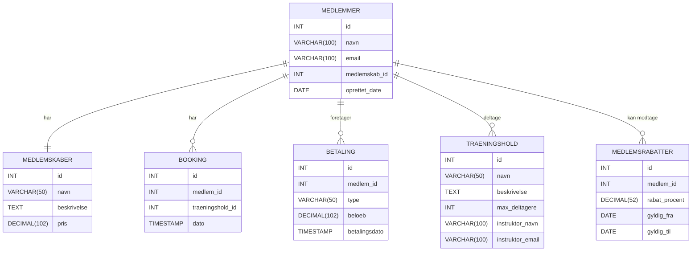
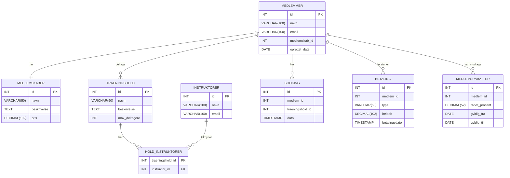
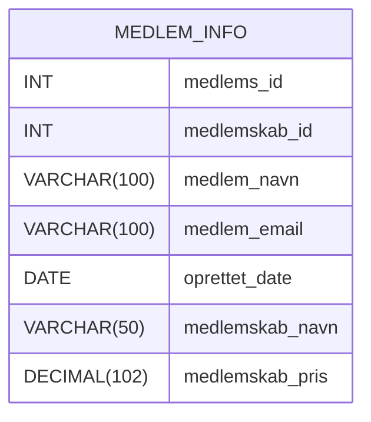
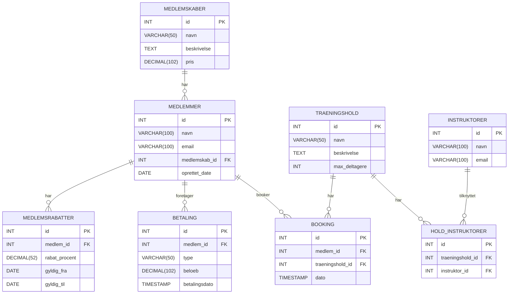

# OLA2_DB_Fitness

Skrevet af: Isak Møgelvang, Jamie Callan og Helena Lykstoft

## ER-Diagram

Vi har lavet dette ER-diagram, hvor vi nedenunder har beskrevet de entiteter og attributter vi har tænkt skulle være med. Derudover har vi også lavet relationerne.

#### Model og beskrivelse

Vi har tilføjet nogle ekstra funktioner, blandt andet har vi tilføjet medlemmer, da vi synes det gav mening at et fitnesscenter har medlemmer. Vi har sat at medlemmer har medlemskab, medlemmer har bookings, medlemmer foretager betaling, medlemmer deltager i et træningshold, medlemmer kan modtage medlemsrabatter og træningshold har instruktører. Derudover har vi også lavet de forskellige entiteter og attributter.

## Dokumentation på normalisering ( kort forklaring og tabel der viser ændringer )

#### 1NF: Sikr jer, at alle attributter er atomare og at der ikke er gentagne grupper.

Dette har vi lavet i vores ER-diagram ovenover.

#### 2NF: Fjern partielle funktionelle afhængigheder (sørg for, at ikke-nøgle attributter afhænger af hele primærnøglen).

Her har vi forsøgt at lave 2. normalform ud fra vores originale ER-diagram. 
For eksempel har vi forbedret tabellen HOLD_INSTRUKTORER ved at fjerne en unødvendig surrogate nøgle og i stedet bruge en kompositnøgle bestående af traeningshold_id og instruktor_id. Dette sikrer, at der ikke opstår partielle afhængigheder.

#### 3NF: Fjern transitive afhængigheder (sørg for, at alle ikke-nøgle attributter kun afhænger af primærnøglen).

Diagrammet Ovenover dækker også forsøget på at opretholded 3. normalform.

Ændringer: 
- I de nu normaliserede tabeller afhænger hver ikke-nøgleattribut direkte af primærnøglen.
- Fx i MEDLEMMER afhænger navn, email og oprettet_date udelukkende af id.
- Der er ingen attributter, der er transitivt afhængige via en fremmednøgle.

Nu opfylder modellen alle normalformer.

#### Eksempel på hvornår 2NF og 3NF er brudt:

- 2NF-brud:
Hvis vi antager, at den sammensatte nøgle er medlems_id og medlemskab_id, afhænger attributterne medlem_navn, medlem_email og oprettet_date kun af medlems_id – altså en del af den sammensatte nøgle og ikke af hele nøglen.

- 3NF-brud:
Attributterne medlemskab_navn og medlemskab_pris afhænger af medlemskab_id og er dermed transitivt afhængige af den sammensatte nøgle, hvilket skaber redundans og potentielle opdateringsproblemer.

**Andet Eksempel på opfyldning af 3NF** er i modellerne ovenover der går fra at have Intruktørenes navn og Email inde i træningshold's tabellen som senere bliver trukket ud i sin egen tabel som resultat tillader en nemmere 1 til mange relation da 1 intstruktør kan have flere hold og vice versa. Dette kan observeres ved at betragte de førnævnte modeller ovenover i rækkefølgen de er sat ind.

## Den relationelle model

#### Billeder og eksempler
Resultatet som en relationsmodel:

MEDLEMSKABER (id PK, navn VARCHAR(50), beskrivelse TEXT, pris DECIMAL(102))
MEDLEMMER (id PK, navn VARCHAR(100), email VARCHAR(100), medlemskab_id FK, oprettet_date DATE)
TRAENINGSHOLD (id PK, navn VARCHAR(50), beskrivelse TEXT, max_deltagere INT)
INSTRUKTORER (id PK, navn VARCHAR(100), email VARCHAR(100))
HOLD_INSTRUKTORER (id PK, traeningshold_id FK, instruktor_id FK)
BOOKING (id PK, medlem_id FK, traeningshold_id FK, dato TIMESTAMP)
BETALING (id PK, medlem_id FK, type VARCHAR(50), beloeb DECIMAL(102), betalingsdato TIMESTAMP)
MEDLEMSRABATTER (id PK, medlem_id FK, rabat_procent DECIMAL(52), gyldig_fra DATE, gyldig_til DATE)

Her er relationsmodellen til dette script: [Script fil](fitness_assignment.sql)

Og her er vores færdige model med mapping, relationer, PK og FK osv: 

